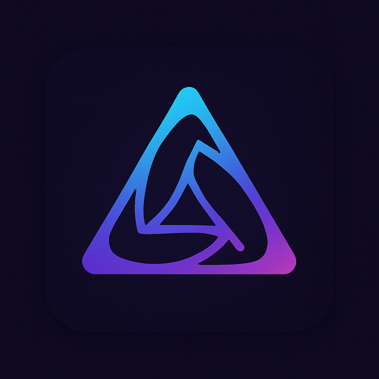

  

<h1 align="center">Triava Labs</h1>

<strong>Designing value in flow.</strong>

---

### About
Triava Labs explores the harmony of <em>Tri</em> (resonance, geometry, balance) and <em>Ava</em> (flow, breath, life‑force) to build systems that move like nature itself — adaptive, interconnected, and alive.

### Focus
- Blockchain infrastructure & interoperability  
- Real‑world asset (RWA) tokenization  
- AI systems designed in flow  

### Projects
- 👉 <a href="projects.md">See projects & whitepapers</a>

### Connect
- X / Twitter: <a href="https://x.com/triavalabs">@triavalabs</a>
- Email: triavalabs@gmail.com

<small>© 2025 Triava Labs</small>
